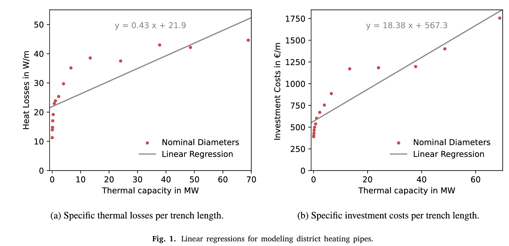

Methodology
=============

Linearization of heat losses and pipe investment costs
--------------------------------------------------------
 The maximal mass flow 𝑚̇  with the corresponding velocities 𝑣 of each considered piping diameter 𝑑 must be determined to linearize the maximal thermal power flow in a district heating pipe with length l. Subsequently, the heat losses of the district heating network pipes can be determined for each diameter. The relationship between the investment costs and heat losses of a pipe with regard to the maximal thermal power flow is modeled with a linear regression.

Initial Assumptions
^^^^^^^^^^^^^^^^^^^^

 * The considered heat carrier medium is liquid water and, therefore, incompressible
 * Temperature changes are assumed to be smaller than 𝛥𝑇=40◦C, therefore,temperature dependencies of the fluid properties (e.g.,density 𝜌,heat capacity cp and dynamic viscosity 𝜇) are neglected because the variations in the property values are small for the considered parameter range.
 * The fluid properties of water are constant and determined at 70◦C. The feed line temperature is assumed to be at constant 90◦C, while the return temperature is assumed to be at constant 55◦C, and with an outdoor temperature of −20◦C
 * The district heating pipes are buried at a depth of 1m and the pipe roughness is assumed to be 0.05mm
 * The thermal conductivity of the ground is equal to 2.4W/(m⋅K) and the conductivity of the thermal insulation, formed by polyurethane, to 0.024W/(m⋅K) 

Calculations
^^^^^^^^^^^^^
The following equations are used to form a full nonlinear thermohydraulic model of a district heating pipe.

Calculating the pressure loss between the nodes i and j:

.. math::
  
  \Delta p_{ij} = f_{ij} \cdot \frac{\text{l}_{ij}}{d_{ij}} \cdot \frac{v_{ij}^2}{2} \cdot \rho
   
Calculating the Reynolds Number:

.. math:: 
  
  Re_{ij} = \frac{\rho \cdot v_{ij} \cdot d_{ij}}{\mu} 

Calculate the friction factor for a turbulent flow (Re > 2300) with pipe roughness 𝜀

.. math:: 

  f_{ij} = \left[ -1.8 \cdot \log \left( \left(\frac{\varepsilon}{3.7 \cdot d_{ij}}\right)^{1.11} + \frac{6.9}{Re_{ij}} \right) \right]^{-2}
    
An iterative calculation (using SciPy) is performed to determine the maximum velocity in a pipe with a given inner diameter. The specific pressure drop per meter pipe length should range from 70Pa/m to 350Pa/m and the initial velocity is 0.5 m/s. 

.. math:: 
  
  v_{max} = \sqrt{\frac{2 \cdot \Delta p_{max} \cdot d}{f \cdot \rho}}

After calculating the maximum speed the maximum flow rate can be calculated using:

.. math.:
  \dot{m} = \tho \cdot v \cdot d^2 \cdot \pi/4

To model the thermal behavior of an insulated pipe buried underground the temperature difference 𝛩 between the water temperature in the pipe and the outside temperature is introduced:

.. math:: 
 
 \Theta_{ij} = \Theta_{i} \cdot \exp\left(\frac{{-\text{l}_{ij}}{-l_{ij}}}{c_p \cdot \dot{m}_{ij} \cdot R_{ij}}\right)

The combined thermal resistance 𝑅𝑖𝑗 of the pipe and soil per unit length is calculated with the ratio 𝑟 between outer and inner diameter.  the buried depth of a pipe ℎ, as well as the thermal conductivities of the ground (𝑘ᵍ) and of the pipe’s insulation (𝑘ⁱⁿˢᶸˡ) are used to calculate the combined thermal resistance.

.. math:: 
  
 R_{ij} = \frac{\ln{\frac{4h}{r \cdot d_{ij}}}}{2\pi \cdot k_{g}} + \frac{\ln{r}}{2\pi \cdot k_{insul}}

Linear regression
^^^^^^^^^^^^^^^^^^

To represent the considered diameter range in a MILP, the nonlinear dependencies have to be represented as continuous and linear within the optimization problem. The linearization in this study is performed with a simple linear regression 𝑦 = a ⋅ 𝑥 + b, where 𝑦 is the dependent variable, 𝑥 is the independent variable, and the factors a and b are the regression coefficients. This approach is adopted to formulate an optimization problem that can be solved within a feasible computing time, consistent with the methodologies of previous works.

For pipes ranging from DN 20 to DN 400, the thermal losses are calculated through the temperature difference between the water and the pipe calculated earlier using the maximal mass flow rate, while the total investment costs for piping are adapted from `Nussbaumer & Thalmann (2016) <https://www.sciencedirect.com/science/article/pii/S036054421630113X?via%3Dihub>`_

 

Mixed-integer formulations for district heating network design
---------------------------------------------------------------

Graphical representation
^^^^^^^^^^^^^^^^^^^^^^^^^

A graph representation of a district heating network has to be introduced to mathematically represent pipes, junctions, producers, and consumers. The district heating systems’ pipes correspond to the graph’s edges and the network’s junctions to the nodes. The district heating network consists of a feed and return network with edges of opposite directions. This superstructure contains all possible connections and pathways from the heat source to the consumers. 

The set of all nodes N is subdivided into three different subsets:  int denotes all nodes without a consumer or a producer, the subscript p describes all nodes connected to at least one producer, and the subscript c all nodes connected to at least one consumer.

.. math:: 
 
 \mathcal{N}_{int} \cup \mathcal{N}_{p} \cup \mathcal{N}_{c} = \mathcal{N}
 

This set 𝐴 representing all edges of the network is subdivided into three different subsets: int represents the geometrical pipe connection between two different internal nodes. p and c denote the state transition between the district heating system and a producer or a consumer, respectively. 

.. math:: 
  
  \mathcal{A}_{int} \cup \mathcal{A}_{p} \cup \mathcal{A}_{c} = \mathcal{A} 

A certain network node will be referred to as 𝑛, whereas a directed edge going from node 𝑖 to node 𝑗 as 𝑖𝑗 ∈ A.
 
.. figure:: graph.png

Single Time Step Formulation
^^^^^^^^^^^^^^^^^^^^^^^^^^^^^

The bidirectionality of the network (two edges per pipe) is explicitly considered and modeled in the single time step formulation of topotherm. In order to allow flows in the opposite direction, every potential pipe 𝑖𝑗 is also modeled in the direction 𝑗𝑖.

The constraints of the sts solution are as follows:

* The heat balance of the pipe, which contains the heat outflow of each pipe Qout, the heat inflow Qin and the thermal losses over the length l𝑖𝑗.The thermal losses are determined by the linear regression coefficients aₜₕₑᵣₘ and bₜₕₑᵣₘ while the binary variable 𝜆𝑖𝑗 represents the flow direction of the considered pipe.

.. math:: 
  
  \dot{Q}_{ij,0} - \dot{Q}_{ij,1} -\left(a_{therm} \cdot \dot{Q}_{ij,0} + b_{therm} \cdot \lambda_{ij} \right) \cdot \text{l}_{ij}  = 0  \qquad \forall ij \in \mathcal{A}_{int}

* A big-M constraint is formulated to enforce zero thermal power flow if the direction 𝑖𝑗 is not used. ̇ 𝑄max is modeled as a sufficiently large constant power flow.

.. math:: 

 \dot{Q}_{ij,0} \leq \dot{Q}_{max,cons} \cdot \lambda_{ij} \qquad \forall ij \in {\mathcal{A}_{int}}

* Each consumer connection to the district heating grid is modeled as unidirectional, and thus no heat feed-in from a consumer is possible. Moreover,energy conservation is assumed in every node under consideration of the consumer’s heat demand and the heat source’s feed-in

.. math:: 

  \dot{Q}_{ni,0} - \dot{Q}_{jn,1} - \dot{Q}_{c,n} + \dot{Q}_{p,n} = 0 \qquad \forall n \in \mathcal{N}, \; (ni, jn) \in  {\mathcal{A}_{int}} 

* To ensure a unidirectional use of a pipe and to reduce the solution space during the Branch-and-Bound, this constraint prevents the simultaneous use of the direction 𝑖𝑗 and 𝑗𝑖.

.. math:: 

  \lambda_{ij} + \lambda_{ji} \leq 1 \qquad \forall ij \in {\mathcal{A}_{int}} \; 

* In this study, all consumers must be connected to the district heating system grid therefore, the direction 𝜆𝑖𝑗 of pipe 𝑖𝑗 to a consumer node 𝑗 is set to 1, forcing the edge to be used and heating to be supplied.

.. math:: 

  \lambda_{ij} = 1 \qquad \forall ij \in {\mathcal{A}_{c}}

* The thermal power output ̇ 𝑄𝑝 is constrained by the installed thermal capacity of the source ̇ 𝑄inst𝑝 

.. math:: 
  \dot{Q}_{p} \leq \dot{Q}_{\text{inst},p} \qquad \forall p \in \mathcal{N}_{p}

The annuity method distributes investment costs of pipes or heat sources over the defined life span 𝑛years with an interest rate w.

.. math:: 
 
  an = \frac{(1+w)^{n_{years}} \cdot w}{(1+w)^{n_{years}} -1}
 
Additional constraints with redundant information can help to tighten further the Branch-and-Bound during the optimization. To that end, a supplementary constraint is formulated to ensure the total system energy conservation.

.. math::

 \sum_{p \in {\mathcal{A}_p}} \dot{Q}_p - \sum_{ij \in {\mathcal{A}_{int}}} \left(\dot{Q}_{ij,0} - \dot{Q}_{ij,1}\right) - \sum_{ji \in {\mathcal{A}_{int}}} \left(\dot{Q}_{ji,0} - \dot{Q}_{ji,1}\right) - \sum_{c \in {\mathcal{A}_c}} \dot{Q}_c = 0 \; 

Finally, the objective function minimizes the district heating network’s total investment and operational costs. 

The investment costs are determined by the linear regression factors aᶜᴼˢᵗ and bᶜᴼˢᵗ. By introducing full load hours flh, the investment and operational costs are weighted.

.. math:: 

 \text{min} \; \bigg\{& \sum_{p \in {\mathcal{N}_p}} {\dot{Q}_{\text{inst},p}} \cdot {c_{\text{inv},p}} \cdot an_p  + \sum_{p \in {\mathcal{N}_p}} \dot{Q}_{p} \cdot {c_{\text{fuel},p}} \cdot {\text{flh}}  \\ & + \sum_{ij \in \mathcal{A}_{int}} \left(a_{cost} \cdot (\dot{Q}_{ij,0}+\dot{Q}_{ji,0}) + b_{cost} \cdot (\lambda_{ij}+\lambda_{ji}) \right) \cdot {\text{l}_{ij}} \cdot an_{pipe} \bigg\}

Multiple Time Step Formulation
^^^^^^^^^^^^^^^^^^^^^^^^^^^^^^^

In order to optimize district heating systems with multiple time steps and changing flow directions with topotherm_mts, the previous formulation needs to be expanded. Not only the bidirectional operation of the pipe has to be modeled, but also a binary variable has to be incorporated to model the decision if a pipe is built independent of the flow direction. As with the sts formulation, only equations in direction 𝑖𝑗 are provided in exemplary fashion below. Moreover, 𝑡 refers to the set of all considered hourly timesteps defined in the set T.

The constraints of the mts solution are as follows:

* The heating power balance of each pipe is enforced.  𝑄out𝑖𝑗,𝑡 is the mean power outflow of each pipe, ̇ 𝑄in𝑖𝑗,𝑡 the inflow and ̇ 𝑄loss𝑖𝑗,𝑡 the thermal losses during time step 𝑡.These equations can be adapted for different time steps durations by changing from a power flow to an energy flow with 𝑄𝑡= ̇ 𝑄𝑡 ⋅𝛥𝑇𝑡.

.. math:: 

  \dot{Q}_{ij,0}[t] - \dot{Q}_{ij,1}[t] - {\dot{Q}_{\text{loss},ij}[t]} = 0  \qquad \forall ij \in {\mathcal{A}_{int}}, \forall t \in \mathcal{T} 

* The thermal losses for pipe 𝑖𝑗 need to be modeled as an independent variable and cannot be incorporated into the equation directly. This is due to the thermal losses along a pipe being nearly independent of the inflowing mass flow rate and depending mostly on the installed diameter

.. math:: 

  &{\dot{Q}_{\text{loss},ij}[t]} - \dot{Q}_{max,cons} \cdot \lambda_{ij}[t] \leq 0 & \forall ij \in {\mathcal{A}_{int}}, \forall t \in \mathcal{T} \label{eq:loss_1}\\ &\left(a_{therm} \cdot {\dot{Q}_{\text{cap},ij}} + b_{therm} \cdot \lambda_{ij}[t]\right) \cdot {\text{l}_{ij}} - {\dot{Q}_{\text{loss},ij}[t]} - \dot{Q}_{max,cons} \cdot \left(1-\lambda_{ij}[t]\right) \leq 0 & \forall ij \in {\mathcal{A}_{int}}, \forall t \in \mathcal{T}

l𝑖𝑗 is the pipe length, atherm and btherm are linear regression coefficients calculated previously, and 𝜆𝑖𝑗,𝑡 is the binary decision to operate direction 𝑖𝑗 in time step t.

If the direction 𝑖𝑗 is not used,the first equation ensures that the heat losses equal 0. The second equation enforces the heat loss calculation with the maximal built thermal capacity ̇ 𝑄max according to the flow direction in the pipe.

* This constraint enforces zero thermal flow if the direction 𝑖𝑗 of a pipe is not used.

.. math:: 

  \dot{Q}_{ij,0}[t] \leq \dot{Q}_{max,cons} \cdot \lambda_{ij}[t] \qquad \forall ij \in {\mathcal{A}_{int}}, \forall t \in \mathcal{T}

* Additionally, the maximal thermal power inflow ̇ 𝑄in𝑖𝑗,𝑡 at each time step 𝑡∈T is limited to the maximal thermal capacity of a pipe and maximal thermal capacity to the binary decision 𝜆built𝑖𝑗 if a pipe is built or not.

.. math:: 

  &\dot{Q}_{ij,0}[t] \leq {\dot{Q}_{\text{cap},ij}} \qquad & \forall ij \in {\mathcal{A}_{int}}, \forall t \in \mathcal{T} \\ & {\dot{Q}_{\text{cap},ij}} \leq \dot{Q}_{max,cons} \cdot {\lambda_{\text{built},ij}} \qquad & \forall ij \in {\mathcal{A}_{int}}

* The decision to build a pipe has to be linked with the possibility to use a certain direction of the pipe.

.. math::
 
  \lambda_{ij}[t] - {\lambda_{\text{built},ij}}  \leq 0  \qquad \forall ij \in {\mathcal{A}_{int}}, \forall t \in \mathcal{T}

* The simultaneous use of the direction 𝑖𝑗 and 𝑗𝑖 is prevented using this constraint.

.. math::

  \lambda_{ij}[t] + \lambda_{ji}[t] \leq 1 \qquad \forall ij \in {\mathcal{A}_{int}}, \forall t \in \mathcal{T}

* In this study, all consumers must be connected to the district heating system grid.Therefore at a node 𝑗 with a consumer,the binary direction 𝑖𝑗 pipe and the binary building decision of that pipe is set to 1

.. math:: 
  &\lambda_{ij} = 1 & \forall ij \in {A_{c}}\\ & {\lambda_{\text{built},ij}} = 1 & \forall ij \in {\mathcal{A}_{c} \; .}

* Additional constraint for energy conservation

.. math:: 
  
  \sum_{p \in \mathcal{A}_{p}} \dot{Q}_p[t] - \sum_{ij \in \mathcal{A}_{int}} \left( \dot{Q}_{\text{loss},ji}[t] + \dot{Q}_{\text{loss},ji}[t] \right) - \sum_{c \in \mathcal{A}_{c}} \dot{Q}_c[t] = 0 \qquad \forall t \in \mathcal{T}

* The thermal power of the source ̇ 𝑄𝑝,𝑡 is limited by the optimal installed thermal power ̇ 𝑄inst𝑝-.

.. math::
  
  \dot{Q}_{p}[t] \leq \dot{Q}_{\text{inst},p} \qquad \forall p \in \mathcal{N}_{p} , \forall t \in \mathcal{T}

The objective function of the sts case is adapted to depict multiple time steps and flow directions. The full load hours are scaled according to the simulated time period and adjust the considered heat demand to the yearly heat demand.

.. math::

  \text{min} \;  \bigg\{& \sum_{p \in \mathcal{N}_{p}} \dot{Q}_{\text{inst},p} \cdot c_{\text{inv},p} \cdot an_p  + \sum_{t \in \mathcal{T}} \sum_{p \in \mathcal{N}_{p}} \dot{Q}_{p}[t] \cdot c_{\text{fuel},p} \cdot \text{flh}   \\ & + \sum_{ij \in \mathcal{A}_{int}} \left(a_{cost} \cdot \dot{Q}_{\text{cap},ij} + b_{cost} \cdot \lambda_{\text{built},p} \right) \cdot \text{l}_{ij} \cdot an_{pipe} \bigg\}

The forced expansion assumed can be easily modified for a planned expansion by eliminating the constraints connecting all consumers and modifying the objective function to economic indicators, such as revenue maximization.

Simplified Multiple Time Step Formulation
^^^^^^^^^^^^^^^^^^^^^^^^^^^^^^^^^^^^^^^^^^

As previously mentioned, the thermal losses in a pipe do not depend on the thermal power flow into the pipe but rather on the installed capacity of the pipe.As the consideration of the installed capacity of the pipe earlier is computationally expensive, an alternative formulation named topothermmts_easy is formulated, where the thermal losses do not depend on the maximal thermal pipe capacity but rather on the thermal power inflow at each time step.

Modified heat balance constraint:

.. math:: 

  \dot{Q}_{ij,0}[t] - \dot{Q}_{ij,1}[t] -\left(a_{therm} \cdot \dot{Q}_{ij,0} + b_{therm} \cdot \lambda_{ij}[t] \right) \cdot {\text{l}_{ij}}  = 0  \qquad \forall ij \in {\mathcal{A}_{int}}, \forall t \in \mathcal{T} \;

Modified objective function

.. math:: 

  \sum_{p \in \mathcal{A}_{p}} \dot{Q}_p[t] - \sum_{ij \in \mathcal{A}_{int}} \left(\dot{Q}_{ij,0}[t] - \dot{Q}_{ij,1}[t\right) - \sum_{ji \in \mathcal{A}_{int}} \left(\dot{Q}_{ji,0}[t] - \dot{Q}_{ji,1}[t]\right) - \sum_{c \in \mathcal{A}_{c}} \dot{Q}_c[t] = 0 \quad \forall t \in \mathcal{T}

  