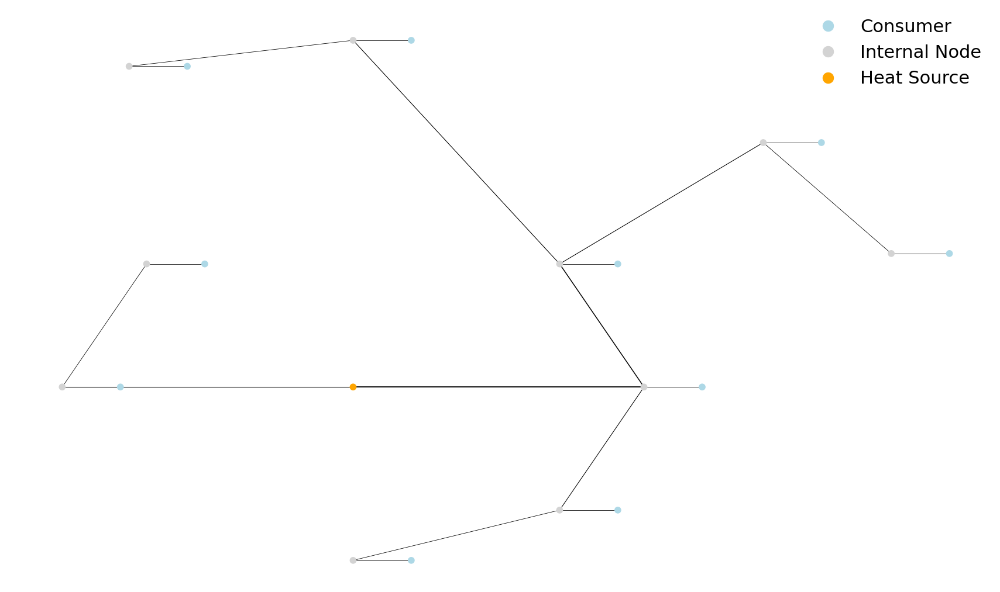

Usage
========

Generate the input incidence matrices for the district with .parquet format (see example).
Then, modify and run the either one of the three scripts in that folder. ::

 bash
 cd example
 python run_sts.py

Contribute
------------

Pull requests and any feedback regarding the code are very welcome. For major
changes, please open an issue first to discuss what you would like to change.

Tests
------

To run the tests, use pytest. ::

 Python
 pytest tests

Example of results
----------------------

   
   Before Optimization

   After Optimization

License
----------

[MIT](https://en.wikipedia.org/wiki/MIT_License), see LICENSE file.

